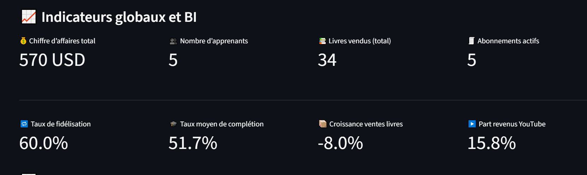
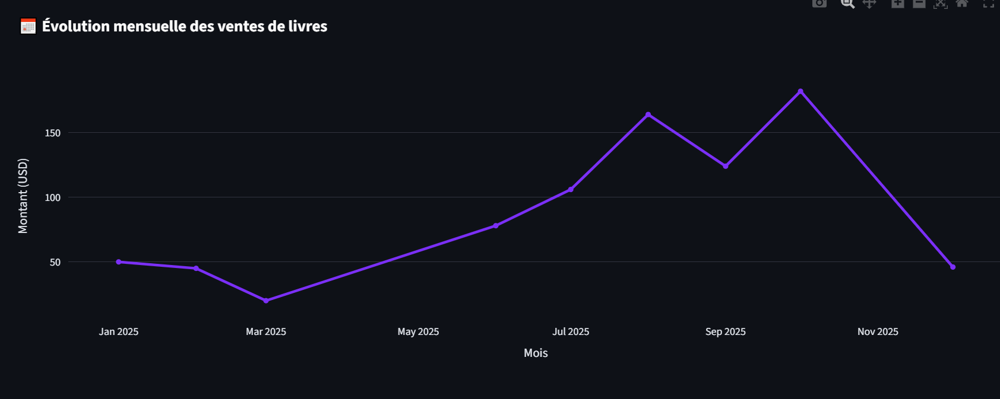
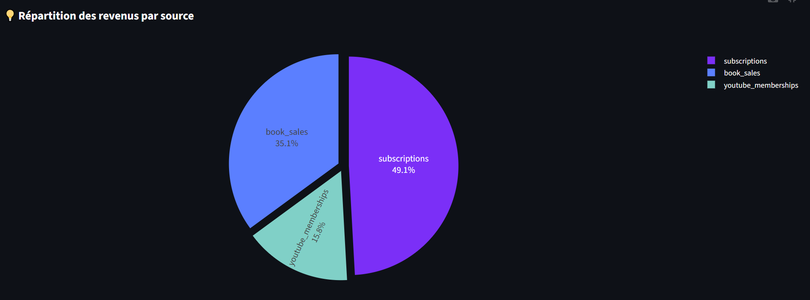

# TTMIK BI Dashboard

A comprehensive **Business Intelligence (BI) dashboard** for **TTMIK (Talk To Me In Korean)** learning platform analytics.  
Built using **Python**, **Streamlit**, **SQLite**, and **Plotly**, this dashboard provides detailed insights into business performance, student engagement, and revenue streams.

## 🌐 Live Demo

**[View Live Dashboard](https://business-intelligence-dashboard-for-ttmik-szxgaazw2gfraof8gz5n.streamlit.app/)**

Experience the full interactive dashboard directly in your browser without any installation required.

---

## Features

- **Global Business Metrics**:
  - Total revenue across all sources
  - Number of active learners
  - Total books sold
  - Active subscriptions count

- **Key Performance Indicators (KPIs)**:
  - Customer retention rate (subscription renewals)
  - Average course completion rate
  - Book sales growth rate
  - YouTube revenue percentage

- **Interactive Visualizations**:
  - Monthly book sales evolution (line chart)
  - Revenue distribution by source (pie chart)
  - Detailed data tables with course progress tracking

- **Multi-source Revenue Tracking**:
  - Book sales analytics
  - Subscription revenue
  - YouTube membership revenue

- **Student Learning Analytics**:
  - Course completion tracking
  - User progress monitoring
  - Learning engagement metrics

## 📸 Screenshots

### Key Performance Indicators Dashboard

*Comprehensive view of business metrics including revenue, learners count, retention rate, and course completion statistics*

### Monthly Sales Evolution

*Interactive line chart showing the growth trend of book sales over time*

### Revenue Distribution Analysis

*Pie chart visualization breaking down revenue streams from books, subscriptions, and YouTube memberships*

---

## Installation & Setup

### 1. Clone the repository and navigate to it

```bash
git clone https://github.com/hibounashi/Business-Intelligence-Dashboard-for-TTMIK
cd Business-Intelligence-Dashboard-for-TTMIK
```

### 2. Create a Python virtual environment
```bash
python -m venv bi
```

### 3. Activate the virtual environment
**Windows:**
```bash
bi\Scripts\activate
```
**Linux / Mac:**
```bash
source bi/bin/activate
```

### 4. Install dependencies
```bash
pip install -r requirements.txt
```

The requirements.txt includes all necessary packages:
- `streamlit` - Web app framework
- `pandas` - Data manipulation and analysis
- `sqlite3` - Database connectivity (built-in Python)
- `plotly` - Interactive visualizations
- Additional dependencies for enhanced functionality

### 5. Create the database
```bash
python create_db.py
```
This will create `TTMIK_BI.db` with sample data including:
- User profiles and demographics
- Course catalog and progress tracking
- Book inventory and sales data
- Subscription management
- Revenue tracking from multiple sources

## Running the Dashboard

```bash
streamlit run streamlit2.py
```

- Open the URL provided in the terminal (usually http://localhost:8501)
- Interact with the dashboard to explore comprehensive TTMIK analytics
- View detailed metrics, KPIs, and interactive visualizations
- Access expandable sections for detailed data tables

## Database Structure

The application uses a SQLite database (`TTMIK_BI.db`) with the following tables:
- **users** - Student profiles and regional data
- **subscriptions** - Subscription plans and renewal tracking  
- **courses** - Course catalog with level and lesson information
- **user_course_progress** - Individual student progress tracking
- **books** - Book inventory with categories and pricing
- **book_sales** - Sales transactions and regional performance
- **revenues** - Consolidated revenue tracking from all sources

## Dashboard Sections

### 📈 Global Indicators
- **Total Revenue**: Aggregated revenue from all sources
- **Active Learners**: Current number of registered users
- **Books Sold**: Total quantity of books sold across all regions
- **Active Subscriptions**: Number of current active subscriptions

### 📊 Key Performance Indicators (KPIs)
- **Retention Rate**: Percentage of subscribers who renewed their plans
- **Course Completion**: Average completion rate across all courses
- **Book Sales Growth**: Month-over-month growth in book sales
- **YouTube Revenue Share**: Percentage of total revenue from YouTube memberships

### 📈 Visualizations
- **Monthly Book Sales Evolution**: Interactive line chart showing sales trends over time
- **Revenue Distribution**: Pie chart breaking down revenue by source (books, subscriptions, YouTube)
- **Detailed Data Tables**: Expandable sections with comprehensive data views

## Technology Stack

- **Backend**: Python 3.x
- **Database**: SQLite3
- **Web Framework**: Streamlit
- **Data Processing**: Pandas
- **Visualizations**: Plotly Express & Plotly Graph Objects
- **UI Components**: Custom metrics and interactive charts

## Sample Data

The database comes pre-populated with realistic sample data:
- 5 users from different global regions
- 18 Korean language courses (Core Grammar, IYAGI, Cultural Topics, etc.)
- 8 book titles covering various Korean learning topics
- Multiple subscription types (Monthly/Annual plans)
- Sales data spanning several months
- Revenue streams from books, subscriptions, and YouTube

## Contributing

This dashboard is designed for educational and demonstration purposes, showcasing BI capabilities for language learning platforms. Feel free to extend the functionality or adapt it for similar educational business models.

---

